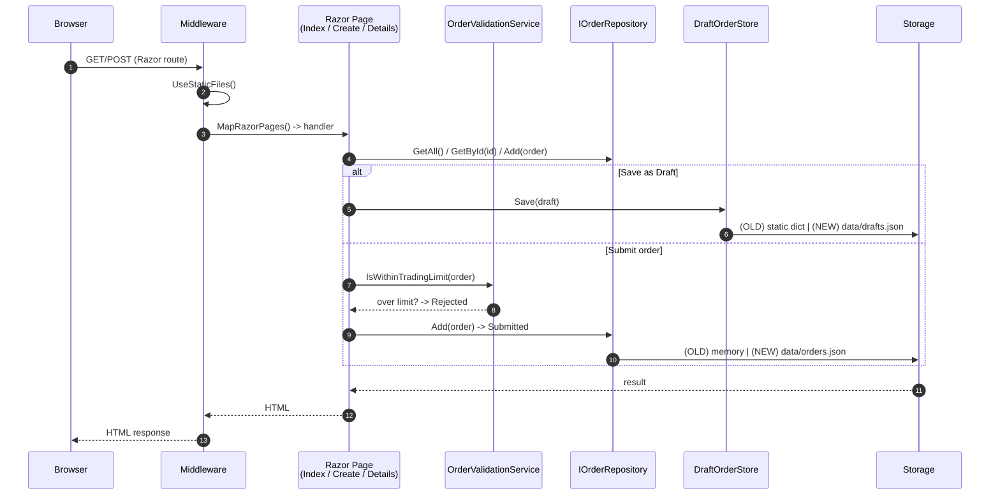
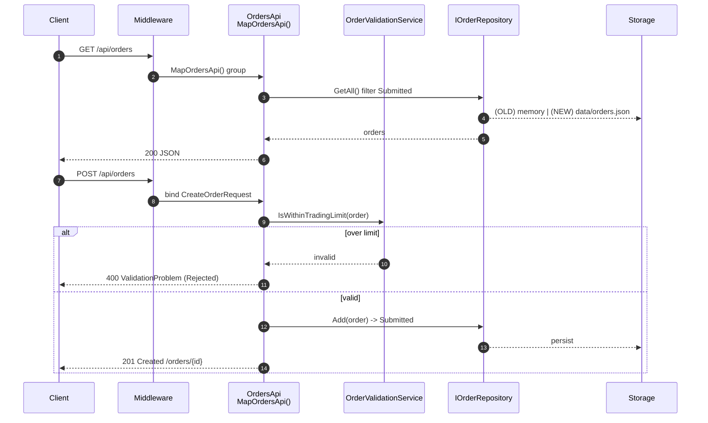
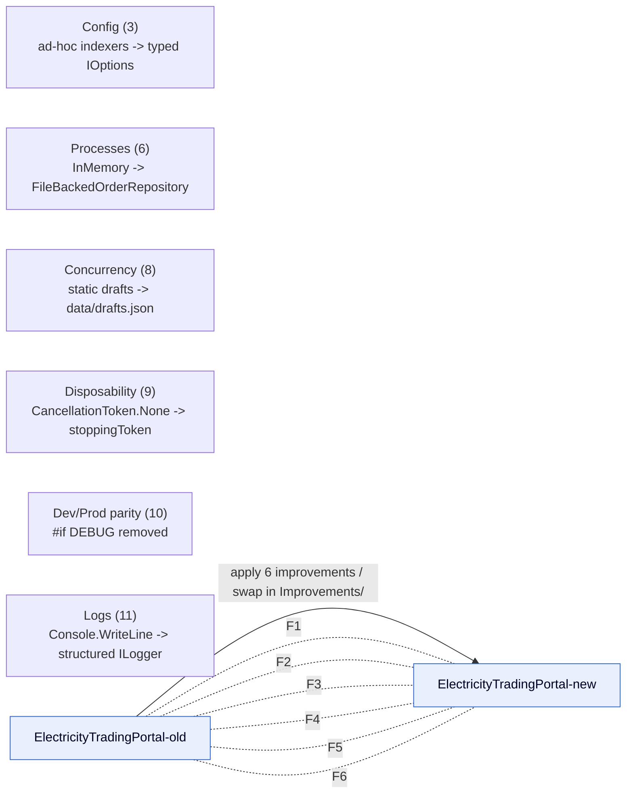

# Electricity Trading Portal — Architecture (Mermaid)

> Diagram set for both `ElectricityTradingPortal-old` (before) and
> `ElectricityTradingPortal-new` (after Twelve-Factor improvements).
> Differences are highlighted inline in each diagram.

---

## 1. High-Level System Overview

```mermaid
flowchart LR
    subgraph Client
        B[Browser / User]
    end

    subgraph App["Electricity Trading Portal (ASP.NET Core / Razor Pages)"]
        M[Middleware Pipeline]
        UI[Razor Pages]
        API[/api/orders Minimal API]
        SVC[Services]
        REPO[Repositories]
    end

    subgraph External
        FEED[Market Data Feed<br/>external REST endpoint]
    end

    subgraph Store["Storage"]
        OLD_MEM["(OLD) In-memory<br/>ConcurrentDictionary"]
        NEW_FILE["(NEW) File-backed JSON<br/>data/orders.json + data/drafts.json"]
    end

    B -->|HTTP| M
    M --> UI
    M --> API
    UI --> SVC
    API --> SVC
    SVC --> REPO
    REPO -->|OLD| OLD_MEM
    REPO -->|NEW| NEW_FILE
    SVC -->|poll| FEED

    classDef old fill:#ffd6d6,stroke:#b00,color:#300;
    classDef new fill:#d6f5d6,stroke:#080,color:#030;
    classDef shared fill:#e8f0fe,stroke:#36c,color:#002;
    class OLD_MEM old;
    class NEW_FILE new;
    class M,UI,API,SVC,REPO,FEED shared;
```

---

## 2. Request Flow — Razor Pages (UI)



---

## 3. Request Flow — Minimal API (/api/orders)



---

## 4. Background Worker — Market Data Polling

```mermaid
flowchart TD
    H["Hosted Service<br/>MarketDataPollingService<br/>(every PollIntervalSeconds)"] --> F[MarketDataFeedClient]
    F -->|GET {MarketDataFeed:Url}/v1/prices/peak| FEED[External Feed]
    FEED -->|PriceSnapshot.LastPrice| F
    F --> LOG{{Log}}

    H --> D[Task.Delay(interval)]

    LOG -. "OLD: Console.WriteLine, errors swallowed" .-> L1[console]
    LOG -. "NEW: structured ILogger with named fields" .-> L2[ILogger]

    D -. "OLD: CancellationToken.None (slow ~30s shutdown)" .- H
    D -. "NEW: honors stoppingToken (~1s graceful stop)" .- H

    classDef old fill:#ffd6d6,stroke:#b00,color:#300;
    classDef new fill:#d6f5d6,stroke:#080,color:#030;
    class L1 old;
    class L2 new;
```

---

## 5. Configuration Flow (Twelve-Factor "Config")

```mermaid
flowchart LR
    subgraph Sources
        J1[appsettings.json]
        J2[appsettings.{env}.json]
        E[Environment Variables<br/>ASPNETCORE_* / TradingLimits__* /<br/>MarketDataFeed__* / OrderStorage__*]
    end

    J1 --> I[IConfiguration<br/>precedence: env > env.json > appsettings]
    J2 --> I
    E --> I

    I --> OLD["(OLD) Program.cs<br/>string indexers + inline fallback"]
    I --> NEW["(NEW) Configure&lt;TradingOptions&gt; /<br/>Configure&lt;MarketDataFeedOptions&gt;"]

    OLD --> SVC_OLD[Services get raw values<br/>e.g. new OrderValidationService(limit)]
    NEW --> OPT[IOptions&lt;T&gt; injected]
    OPT --> SVC_NEW[Services resolve IOptions + ILogger]

    classDef old fill:#ffd6d6,stroke:#b00,color:#300;
    classDef new fill:#d6f5d6,stroke:#080,color:#030;
    classDef shared fill:#e8f0fe,stroke:#36c,color:#002;
    class OLD,SVC_OLD old;
    class NEW,OPT,SVC_NEW new;
    class I shared;
```

---

## 6. Dependency / Service Registration (DI Container)

```mermaid
flowchart TD
    subgraph OLD["(OLD) Program.cs"]
        o1[AddSingleton IOrderRepository -> InMemoryOrderRepository]
        o2[AddSingleton new OrderValidationService(limit)]
        o3[AddSingleton new MarketDataFeedClient(HttpClient, url)]
        o4[AddHostedService MarketDataPollingService(feed, interval)]
    end

    subgraph NEW["(NEW) Program.cs"]
        n1[Configure TradingOptions / MarketDataFeedOptions]
        n2[AddSingleton IOrderRepository -> FileBackedOrderRepository<br/>OrderStorage:FilePath -> data/orders.json]
        n3[AddSingleton OrderValidationService<br/>IOptions + ILogger]
        n4[AddSingleton MarketDataFeedClient<br/>IOptions + ILogger]
        n5[AddHostedService MarketDataPollingService<br/>IOptions + ILogger]
    end

    o1 -. "#if DEBUG skips limit check" .- o2
    n2 --> Ndata[data/orders.json + data/drafts.json]

    classDef old fill:#ffd6d6,stroke:#b00,color:#300;
    classDef new fill:#d6f5d6,stroke:#080,color:#030;
    class OLD old;
    class NEW,Ndata new;
```

---

## 7. Old vs New — Six Twelve-Factor Improvements


